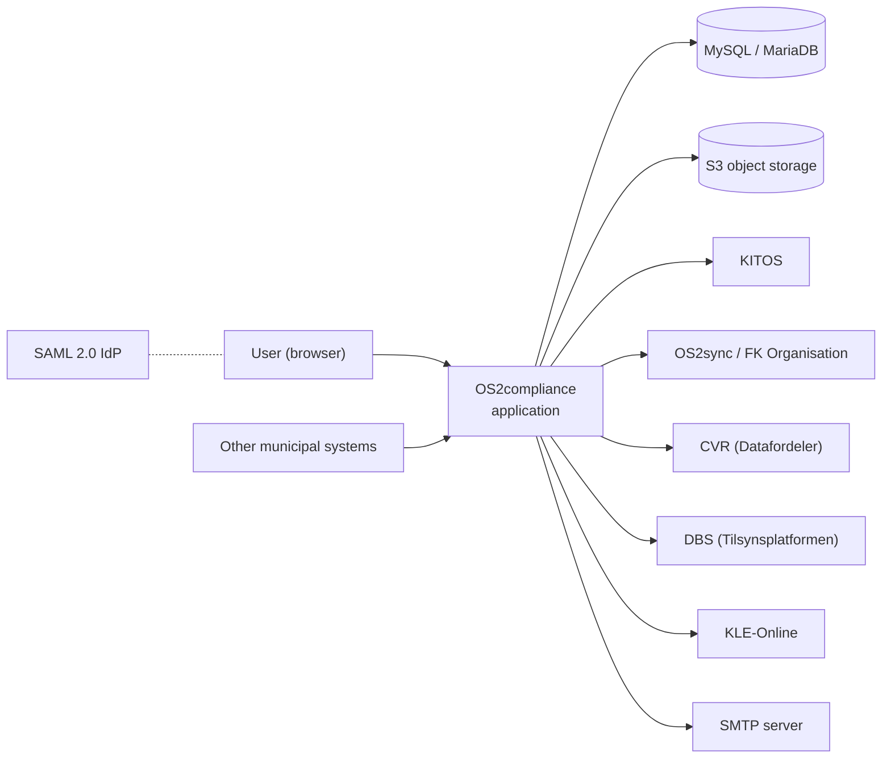
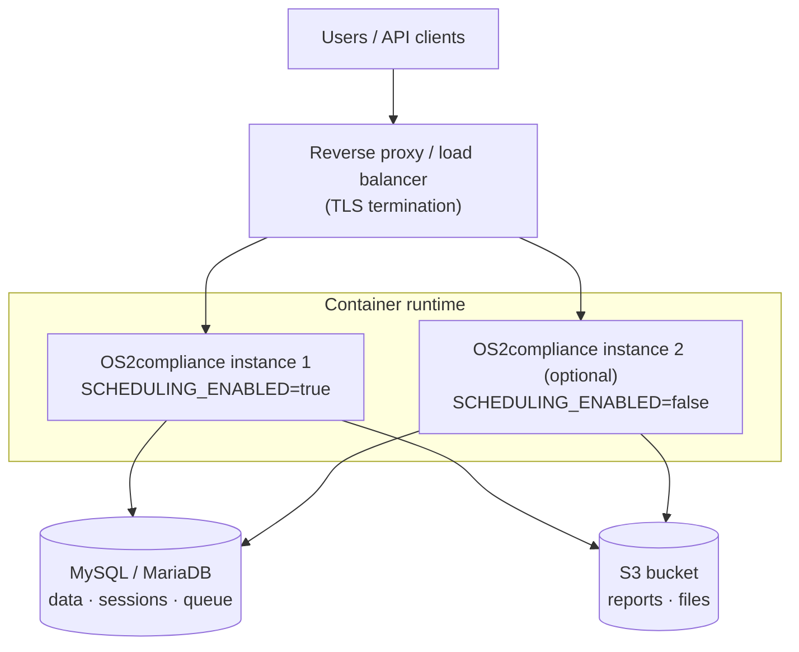

# Architecture

This page describes the overall system architecture of OS2compliance. It is aimed at municipalities, operations staff and anyone evaluating or hosting the solution. For build/run instructions see [hosting](hosting.md), and for the integration API see the [API reference](api/api.md).

## Overview

OS2compliance is a single self-contained Java application built on Spring Boot (Java 21). The web interface (server-rendered with Thymeleaf) and the REST API run in the same process — there is no separate frontend application. Besides the application itself, a deployment needs:

* A **MySQL or MariaDB** database — holds all application data, user sessions and the internal job queue.
* An **S3-compatible object storage bucket** — holds generated reports, signed PDFs and uploaded images. This is required for report generation, PDF signing and image upload to work; there is no filesystem fallback.
* A **SAML 2.0 IdP** (e.g. AD FS or OS2faktor) for user login.

Each municipality runs its own instance with its own database — the solution is **single-tenant**. The municipality's CVR number and name are part of the instance configuration and drive the integrations.

## System context

All integrations to external services are **outbound HTTPS calls initiated by OS2compliance** on a schedule — there are no inbound webhooks and no message broker. The only inbound traffic is user logins (SAML) and calls to the REST API.

| System | Direction | Purpose |
|---|---|---|
| [KITOS](integrations/kitos.md) | Outbound, read **and** write | Imports IT systems, suppliers, contracts and users. Writes risk assessment and DPIA results back to the IT system usage in KITOS. |
| [OS2sync / FK Organisation](integrations/os2sync.md) | Outbound, read | Imports the organisation hierarchy: organisation units, users and positions. Users no longer present are deactivated. |
| [CVR via Datafordeleren](integrations/cvr.md) | Outbound, read | Enriches suppliers with name, address and contact information looked up by CVR number. |
| DBS (Tilsynsplatformen) | Outbound, read | Imports supervision/audit records and creates follow-up tasks. |
| KLE-Online | Outbound, read | Nightly synchronisation of the KLE taxonomy (main groups, groups, subjects). A bundled snapshot is used until the first sync. |
| [Mail (SMTP)](integrations/mail.md) | Outbound | Deadline reminders, notifications and report delivery. STARTTLS on port 587. |
| SAML 2.0 IdP | Inbound login | User authentication — see below. |
| REST API clients | Inbound | Lets other municipal systems read and write assets, documents, organisations, suppliers and users. See the [API reference](api/api.md). |

Every integration is individually enabled/disabled and scheduled through configuration — see the [list of configuration properties](hosting.md#list-of-configuration-properties).

## Runtime view

The application is one deployable unit with an embedded web server (Tomcat, default port 8343). TLS can be terminated in-process by the embedded server or by a reverse proxy in front — `X-Forwarded-*` headers are honoured.

Three things run inside the application process:

* **Web UI and REST API** — the interactive application and the integration API.
* **Scheduled jobs** — all integration synchronisation and housekeeping runs as internal scheduled tasks (see table below). Jobs can be switched off per instance with `SCHEDULING_ENABLED`.
* **Internal job queue** — asynchronous work (e.g. writing risk/DPIA results back to KITOS) goes through a lightweight queue persisted in the database. No external message broker is used.

HTTP sessions are stored in the database rather than in memory. This makes it possible to run **multiple application instances against the same database** for redundancy. When doing so, only one instance should run with `SCHEDULING_ENABLED=true`, since the scheduled jobs do not coordinate between instances.

### Scheduled jobs

Defaults shown below; every schedule is a configurable cron expression.

| Job | Default schedule |
|---|---|
| KITOS delta sync | Every 30 minutes |
| KITOS full re-sync | Daily at 03:00 |
| OS2sync organisation/user import | Daily at 10:00 |
| CVR supplier enrichment | Hourly |
| DBS audit sync | Daily at 03:00 (follow-up tasks hourly) |
| KLE taxonomy sync | Daily at 02:30 |
| Notification e-mails | Every 5 minutes |
| Risk assessment recalculation | Hourly |
| Relation cleanup | Nightly |

## Data storage

* **Database (MySQL/MariaDB):** all application data. The schema is managed with Flyway and migrations run automatically at startup, so upgrading is a matter of deploying a newer image against the same database.
* **Object storage (S3):** all binary files — generated risk assessment and DPIA reports, digitally signed PDFs and images uploaded through the rich-text editor. The database only stores the object keys; no files are stored as blobs in the database.
* **Local disk:** used only as temporary scratch space during report generation and mail sending. Nothing persistent is written to the container filesystem, so containers are disposable.

Governance documents managed in the Documents module are stored as metadata plus a link to the municipality's own document repository — the documents themselves are not uploaded to OS2compliance.

## Authentication and authorization

**Interactive users log in exclusively through SAML 2.0** — there is no local username/password login. Any standard SAML 2.0 IdP can be used; AD FS and OS2faktor are the documented setups. Users must already exist in OS2compliance before they can log in — they are provisioned automatically through the OS2sync integration (matched on UUID from the SAML NameID).

Roles are delivered as a SAML claim (claim name and values are configurable). Five coarse roles are mapped to fine-grained rights at login:

| Role (default claim value) | Access |
|---|---|
| `ROLE_administrator` | Full access including administration and settings |
| `ROLE_forandre` | Superuser — create/edit/delete everything |
| `ROLE_adgang` | Regular user — full access to entities they own or are responsible for |
| `ROLE_begrænset` | Limited user — restricted section access |
| `ROLE_læs_kun` | Read-only |

**The REST API authenticates with API keys**, not SAML. Each consuming system gets its own key, which it sends in the `ApiKey` HTTP header. API clients are managed directly in the database (the `api_clients` table) — there is no UI for administering them. See [authentication](api/authentication.md).

## Deployment view

* The application ships as a Docker image (`ghcr.io/os2compliance/os2compliance`), released automatically — see [hosting](hosting.md#docker) for tags.
* All configuration is injected through environment variables; no configuration files need to be baked into the image.
* A single instance is sufficient for normal operation. A second instance can be added for redundancy as described above.
* Time zone inside the image is fixed to Europe/Copenhagen.
