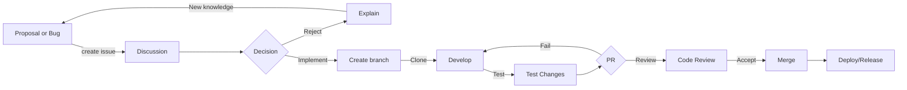

```mermaid
flowchart LR
    A[Proposal or Bug]-->|create issue|B[Discussion]
    B-->C
    C -->|Reject| F[Explain]-->|New knowledge|A
    C{Decision}-->|Implement| D[Create branch]
    D-->|Clone|E[Develop]
    E-->|Test|I[Test Changes]
    I-->G{PR}-->|Fail|E
    G-->|Review|J[Code Review]
    J-->|Accept|H[Merge]
    H-->K[Deploy/Release]
```
